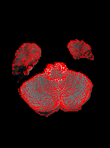
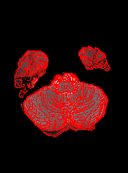
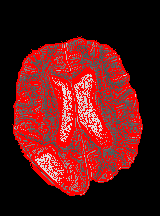

# Unsupervised Edge Segmentation CNN

This Edge Detector CNN model it has been built taking inspiration from the [Ruohui Wang's](http://www.springer.com/cda/content/document/cda_downloaddocument/9783319406626-c2.pdf?SGWID=0-0-45-1575688-p180031493) paper. 
Is a Convolutional Neural Network  that perform and  edge detection. This Neural Network is trained through the help of canny edge detector that assist the patch extraction task allowing to label as edge all patches of size 23x23 that present a certain score when evaluated through a 'count_center' function that all sums feature inside the 3x3 square cetered at the patch center.
The three input channel to each patch is composed by the grayscale negative brain image at first place, the grayscale filtered image at second place,  and the laplace filtered image at third place. The wollowing choice it has been made in order to simplify the pattern research of the Network.

Each patch is processed through the model:

| Layers      | Input           | Output |
| --- |---|---|
| Convolution | 3x23x23 | 32x7x7 |
| Relu| 32x7x7  | 32x7x7  |
| Convolution  | 32x7x7 | 32x3x3|
| Relu| 32x3x3 | 32x3x3 |
|Fully Connected|288|2|

At the end of the model is used The SoftMax activation function.

After the CNN edge evaluation, is possible to apply more the Canny filter to the image.

As for the previous cnn the workflow is the following 

## Results 
The images filtered after 17000 patches augmented rotating each patch of 90 degrees around the center, 3 times gives the following results:

Applyng then the canny filter as post processing I've got the following result:

## How to use

### Ho to run Cnn

	user path/to/package $	python edge_detector_cnn.py  -option expected_value

### All available Options
	
	-train','-t',		set the number of data to train with default=1000 (int value expected)
                        
	-augmentation','-a',		set data augmentation option through rotating angle express values in degrees, as default no augmentation is made (int value expected)
	
	'-modality','-m',		set to use model for hgg(True) or lgg(False), default=True (boolean value expected)
                        
	'-load','-l',		load the model already trained, as default no load happen. insert model name as: 'model_name' (string value expected)
	
                              	
    '-sigma', 	set the sigma value to apply'
                              		' for the canny edge extractor in the
                              		patch extraction,\n default=1.0 
	
	'-save', '-s',	save the trained model in the specified path, as  default no save happen( the name and all it's specification happens automatically) (no value expected)
	
	-augmentation','-a',	set data augmentation option through the specified rotating angle express values in degrees, default=0'
                             
	'-canny','-c',	add canny filter to segmented image ( concatenate '-test' option before using it)
	'-both','-b',		 save both canny filter to segmented image  and segmented image (use -test option before using it)
	'-test',	execute test and saves results in 'results' folders