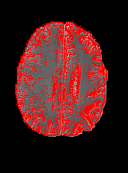
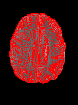

# Two Different  CNN For Segmentation

## What is and what does first CNN

Is a convolutional neural network inspired on the paper of *[ (S. Pereira et al.)]( http://ieeexplore.ieee.org/stamp/stamp.jsp?tp=&arnumber=7426413&isnumber=7463083)*  for the model implementation and the code of [Nikki Aldeborgh
(naldeborgh7575)](https://github.com/naldeborgh7575/brain_segmentation) for the patch extraction and image preprocessing.

The model for HGG tumor modality is the following:

| Layers      | Input           | Output |
| --- |---|---|
| Convolution | 4x33x33 | 64x33x33 |
|Leaky Relu| 64x33x33 | 64x33x33 |
| Convolution  | 64x33x33| 64x33x33|
|Leaky Relu| 64x33x33 | 64x33x33 |
| Convolution  | 64x33x33| 64x33x33|
|Leaky Relu| 64x33x33 | 64x33x33 |
|Max Pooling|  64x33x33| 64x16x16 |
| Convolution  | 64x16x16| 128x16x16|
|Leaky Relu | 128x16x16| 128x16x16|
| Convolution  | 128x16x16| 128x16x16|
| Convolution  | 128x16x16| 128x16x16|
|Leaky Relu | 128x16x16| 128x16x16|
|Max Pooling| 128x16x16| 128x7x7|
|Fully Connected|6272|256|
|Fully Connected|256|5|

 For LGG tumor modality instead the following

| Layers      | Input           | Output |
| --- |---|---|
| Convolution | 4x33x33 | 64x33x33 |
|Leaky Relu| 64x33x33 | 64x33x33 |
| Convolution  | 64x33x33| 64x33x33|
|Leaky Relu| 64x33x33 | 64x33x33 |
|Max Pooling|  64x33x33| 64x16x16 |
| Convolution  | 64x16x16| 128x16x16|
|Leaky Relu| 128x16x16| 128x16x16|
| Convolution  | 128x16x16| 128x16x16|
|Max Pooling| 128x16x16| 128x7x7|
|Fully Connected|6272|256|
|Fully Connected|256|5|

For both models in the and is used the SoftMax activation function.

1. In 

	- brain_pipeline
	- patch_extractor
	- patch_library

 the conversion of all '.mha'  files into '.png'  to all brain images is performed. To each brain image from every patient, all different modalities ( (FLAIR), T1, T1-contrasted, and T2 )   are put together into one  single stripe .  The output for an image is the following:
 
 

 

2.  in Segmentaion_Model the cnn models are created and compiled. Is possible to choose between hgg or lgg model (as descibed in the article) depending from which kind of tumoral pattern is treated.

3.  in image_png_converter there is a randomic conversion of a mha file into png file in order to output some testing material.

The workflow is described as follow:

## Results 
This is the segmented image with a low number of patches 10000

For a sharpen result 100000 or 150000 patches are reccomended 

## How to use  First CNN

### Ho to run Cnn

	user path/to/package $	python Segmentation_Model.py -option expected_value

### All available Options
	
	-train','-t',		set the number of data to train with default=1000 (int value expected)
                        
	-augmentation','-a',		set data augmentation option through rotating angle express values in degrees, as default no augmentation is made (int value expected)
	
	'-modality','-m',		set to use model for hgg(True) or lgg(False), default=True (boolean value expected)
                        
	'-load','-l',		load the model already trained, as default no load happen. insert model name as: 'model_name' (string value expected)
	
	'-save', '-s',	save the trained model in the specified path, as  default no save happen( the name and all it's specification happens automatically) (no value expected)
	
	'-test',			execute test with the expressed datas (no value expected)

## What is and what does Unsupervised Edge Segmentation CNN

This Edge Detector CNN model it has been built taking inspiration from the [Ruohui Wang's](http://www.springer.com/cda/content/document/cda_downloaddocument/9783319406626-c2.pdf?SGWID=0-0-45-1575688-p180031493) paper. 
Is a Convolutional Neural Network  that perform and  edge detection. This Neural Network is trained through the help of the Prewitt filter together with the Gaussian Laplacian that assist the patch extraction task allowing to label as edge all patches of size 23x23 that present a certain score when evaluated through a 'count_center' function that all sums feature inside the 3x3 square cetered at the patch center.
The three input channel to each patch is composed by the grayscale brain image at first place, the prewitt filtered image at second place,  and the Laplacian filtered image at third place. The wollowing choice it has been made in order to simplify the pattern research of the Network.

Each patch is processed through the model:

| Layers      | Input           | Output |
| --- |---|---|
| Convolution | 3x23x23 | 32x7x7 |
| Relu| 32x7x7  | 32x7x7  |
| Convolution  | 32x7x7 | 32x3x3|
| Relu| 32x3x3 | 32x3x3 |
|Fully Connected|288|2|

At the end of the model is used The SoftMax activation function.

After the CNN edge evaluation, is possible to apply more the Canny filter to the image.

As for the previous cnn the workflow is the following 

## Results 
The images filtered after 17000 patches augmented rotating each patch of 90 degrees around the center, 3 times gives the following results:

Applyng then the canny filter as post processing i got the following result:

## How to use  Edge Segmentation CNN

### Ho to run Cnn

	user path/to/package $	python edge_detector_cnn.py  -option expected_value

### All available Options
	
	-train','-t',		set the number of data to train with default=1000 (int value expected)
                        
	-augmentation','-a',		set data augmentation option through rotating angle express values in degrees, as default no augmentation is made (int value expected)
	
	'-modality','-m',		set to use model for hgg(True) or lgg(False), default=True (boolean value expected)
                        
	'-load','-l',		load the model already trained, as default no load happen. insert model name as: 'model_name' (string value expected)
	
	'-trshlap','-lap',	set the treshold value to apply
                              		'for the laplacian filter in patch extraction,\n default=0.53 (exected a value between 0 and 1)
                              	
    '-trshprew','-prew',	set the treshold value to apply'
                              		' for the prewitt filter in patch extraction,\n default=0.15 (exected a value between 0 and 1)
	
	'-save', '-s',	save the trained model in the specified path, as  default no save happen( the name and all it's specification happens automatically) (no value expected)
	
	-augmentation','-a',	set data augmentation option through the specified rotating angle express values in degrees, default=0'
                             
	'-canny','-c',	add canny filter to segmented image ( concatenate '-test' option before using it)
	'-both','-b',		 save both canny filter to segmented image  and segmented image (use -test option before using it)
	'-test',	execute test and saves results in 'results' folders
	

# Packages used

- __future__ 
-  keras
- sklearn
- skimage
- glob 
- errno 
- os 
- numpy 
- argparse
- json

